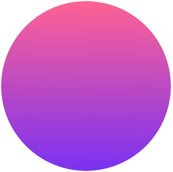

# 幸运转盘
> 幸运转盘这种抽奖模式，已经烂大街了。
> 但是想把效果做好还是需要一定的手法。
# 需求来源
项目中需要一个幸运转盘
1. 点击抽奖之后转盘旋转
2. 转盘转到相应的奖项停下
3. 旋转做缓动，先加速运动然后减速运动
# 使用canvas来制作动画
使用的组件为createjs。
https://www.createjs.com/
## stage
我专门把stage做了一个封装。
```js
import 'latest-createjs';

const VER = "1.0";
const EVENT = {};

function main(canvas) {
  const _this = this;
  const FPS = 60;	//帧频
  const WIDTH = 800;
  const HEIGHT = 800;
  let __game = null;  //主体
  _this.init = function () {
    _this.Stage_constructor(canvas);//继承stage
    createjs.Ticker.setFPS = FPS;	//帧频
    createjs.Ticker.addEventListener('tick', _this);	//按照帧频更新舞台
    createjs.Touch.enable(_this);	//启用tauch
    __game = new createjs.Container()
    _this.addChild(__game);
  }
  _this.launch = function () {
    ……
  }
  _this.init(canvas);
}
main.prototype = createjs.extend(main, createjs.Stage);
main = createjs.promote(main,"Stage");
export {
  VER,
  EVENT,
  main
}
```
> 学习了class的继承，就是元素本身就是stage。
> 
> 这一点有点复杂，但是不妨碍，复制粘贴就行了。
## 原件开发
我们来做转盘所有的原件
### 1	底部表盘
> 表盘分为两个部分，一个是底部的，一个是显示奖品的。
>
> 底部的表盘不是不动的，转动的是显示奖品的表盘。
>
#### 1) 圆盘

> 
> 就是画一个圆，填充是线性的。
```js
const RADIUS_GRADATION = 339;	//半径
let s = new createjs.Shape();
  s.graphics
    .beginLinearGradientFill(["#FF6293", "#7A31F2"], [0, 1], 0, -RADIUS_GRADATION, 0, RADIUS_GRADATION)
    .drawCircle(0,0, RADIUS_GRADATION);
```
#### 2) 小圆点

>
> 还是画一个圆，填充是线性的。
```js
const RADIUS = 10;	//半径
let s = new createjs.Shape();
  s.graphics
    .beginLinearGradientFill(["#FFF8F8", "#EDB1BC", "#FFFBF9"], [0,0.68, 1], 0, -RADIUS, 0, RADIUS)
    .drawCircle(0,0, RADIUS);
```
#### 3) 小圆点圆形排列

>
> 为了方便，我们把之前的小圆点做成一个module。
```js
import 'latest-createjs';
var Instrument = function() {
  var _this = this;
  const RADIUS = 10;	//半径
  let __entity = null;  //主体
  _this.init = function(){
    _this.Container_constructor();
    __entity = createEntity();
    _this.addChild(__entity);
  };
  function createEntity() {
    let s = new createjs.Shape();
    s.graphics
      .beginLinearGradientFill(["#FFF8F8", "#EDB1BC", "#FFFBF9"], [0,0.68, 1], 0, -RADIUS, 0, RADIUS)
      .drawCircle(0,0, RADIUS);
    return s;
  }
  _this.init();
};
Instrument.prototype = createjs.extend(Instrument, createjs.Container);
Instrument = createjs.promote(Instrument,"Container")
export default Instrument;
```
> 然后就可以用来构造这个类了。
```js
let instrument = new Instrument();
```
> 按照设计稿，我们要创建24个排成一个圆圈。
>
> 24个排成一个圆，就是360/24。
>
> 数学计算一般用的是弧度，而不是角度，也就是2π为360度。
>
> 那么每个小圆点的间隔就是2π/24，约分之后就是π/12。
>
> 第n个圆点就是n * π/12。
>
> 按照三角函数y=sinθ * r，x=cosθ * r，r为半径。
```js
const RADIUS_INSTRUMENT = 310;	//半径
for(let i = 0; i < 24; i++){
  let instrument = new Instrument();
  instrument.x = Math.cos(i * Math.PI/12) * RADIUS_INSTRUMENT;
  instrument.y = Math.sin(i * Math.PI/12) * RADIUS_INSTRUMENT;
  __entity.addChild(instrument);
}
```
#### 4) 小圆点闪烁
> 小圆点需要闪烁。
>
> 闪烁怎么做呢？最简单的就是透明度从0到1的变化。
```js
instrument.alpha = 0;
instrument.alpha = 1;
```
> 怎么实现这样一个过渡呢？
>
> 可能你要想着一直执行一个动画。
```js
setTimeout(() =>{
  instrument.alpha += 0.1;
}, 100);
```
> 不用那么复杂，tween类网上多的是。
>
> createjs也封装了专门合适自己用的tween。
```js
createjs.Tween.get(
  instrument, //实行缓动的对象
  {
    bounce:true,  //回弹效果，就是动画执行完毕之后反方向执行，这段动画就是透明度1到0之后在执行0到1
    loop:-1  //循环次数，-1为无限循环
  }
).to(
  {
    alpha:0 //缓动对象的属性，本次是alpha（透明度）
  },
  1000  //缓动间隔，这次动画就是透明度1到0总共用1秒（1000毫秒）执行完
);
```
> 闪烁哪里有一起闪的，本次设计小姐姐提出的要求是交替闪烁，就是奇数出现时候，偶数消失；偶数出现时候，奇数消失。
>
> 怎么完成呢？tween专门给了gotoAndPlay的方法。
>
> 比如整个动画是2000毫秒执行完毕，我们可以让奇数的圆从第0秒开始播放，偶数的圆从第1000秒开始播放。
```js
for(let i = 0; i < 24; i++){
  instrument.run(i%2===0?1000:0); //能被2整除的就是偶数
}
```
> instrument中的run都做了啥呢？
>
> 我们刚才说过gotoAndPlay。
```js
_this.run = function(delay) {
  _tween.gotoAndPlay(delay);
}
```
> 这个_tween怎么写的呢？
>
> 就是把之前的tween专门赋值给了一个叫_tween的成员变量。
```js
_tween = createjs.Tween.get(__entity, {bounce:true, loop:-1, pause:true}).to({alpha:0}, 1000);
```
> 这时候大家可以开动一下脑筋，比如做一个拖影的效果灯，怎么完成呢？
>
> 期待你做出自己喜欢的灯效。
### 2	奖品表盘
> 奖品表盘需要画出来奖品，并且是等分的。
#### 1)	单个奖项
> 比如有8个奖项，我们可以理解为分成8个扇形，然后拼成一个圆。
>
> 别的先不想，画一个扇形出来吧。
>

```js
const RADIUS = 287;	//半径
const unit = Math.PI*2 / 8; //一个扇形的弧度，因为画8个扇形，所以一个就是2π/8
const color = '#FFBAD7';  //颜色值
let shape = new createjs.Shape();
shape.graphics
  .beginFill(color) //填充颜色
  .moveTo(0,0)  //做标移至0,0位置，也就是做标原点
  .arc(0,0, RADIUS, -Math.PI/2-unit/2,-Math.PI/2+unit/2)  //画弧线
  .lineTo(0,0)  //线回到原点
  .endFill(); //结束填充
```
> 为了方便标识，我们填上一个文字。
>
> 按照嵌套关系，我们先建立一个空的container，类似一个div里面包含一个span和一个image。
```js
let container = new createjs.Container(); //载体
let shape = new createjs.Shape();
……
let text = new createjs.Text("拍币", "40px Arial", "#000000");
text.textAlign = "center";
text.y = -RADIUS * 3/4;
container.addChild(shape, text);  //刚才的text和之前shape添加到container，然后我们控制这个container
```
#### 2)	多个奖项
> 现在按照画一个的样子画出8个来吧。
>
> 然后要把8个做一下旋转。
>

>
> 第一步，我们先看看奖品的数组。
>
```json
"lotteryAwardVoList": [{
	"activityInfoId": "10061812170267",
	"itemCode": "10061545023622454",
	"itemName": "4999元",
	"itemType": 0,
	"itemDesc": "锦鲤礼包",
	"itemPic": "jfs/t1/19895/12/2013/1220/5c186167Efdd5149b/a6a5456d126496d6.jpg",
	"awardNum": 1
}, {
……
}, {
	"activityInfoId": "10061812170267",
	"itemCode": "10061545023622489",
	"itemName": "10元",
	"itemType": 1,
	"itemDesc": "优惠券",
	"itemPic": "jfs/t1/6429/27/9888/1073/5c1861b2E9365808f/17d956ae160be379.jpg",
	"awardNum": 1
}]
```
> lotteryAwardVoList是一个数组，数组中有几个元素，就生成几个奖项。
>
> 按照rotation就是旋转角度，注意，这个是角度不是弧度。
```js
const unit = Math.PI*2 / lotteryAwardVoList.length;
lotteryAwardVoList.forEach((v, i) => {
  let sector = ...;  //一个扇形
  sector.rotation = i * 360/lotteryAwardVoList.length;  //按照索引旋转
});
```
> 既然我们需要创建多个重复的扇形，可以吧画扇形封装成一个函数，或者一个类。
```js
/**
 * 绘制单个奖励
 * @param {Object} obj 奖品参数
 * @param {String} color 颜色
 * @param {int} radius 扇形半径
 * @param {radians} radians 扇形弧度
 */
function createAwardSingle(obj, color, radius, radians){
  let container = new createjs.Container();
  let shape = new createjs.Shape();
  shape.graphics
    .beginFill(color)
    .moveTo(0,0)
    .arc(0,0, radius, -Math.PI/2-radians/2,-Math.PI/2+radians/2)
    .lineTo(0,0)
    .endFill();
  let text = new createjs.Text(obj.itemName, "40px Arial", "#000000");
  text.textAlign = "center";
  text.y = -radius * 3/4;
  container.addChild(shape, text);
  return container;
}
```
#### 3)	转起来
> 我们刚才用过了透明度的过渡动画，现在做一下旋转的就可以了。
```js
let __entity = new createjs.Container();  //主体，之前创建的扇形都在这里
let _awardConfig = lotteryAwardVoList;  //奖品数组
/**
 * 运行
 * @param {int} awardIndex  奖品索引
 */
_this.run = function(awardIndex){
  const unit = 360/_awardConfig.length;
  let degree = unit * awardIndex + Math.random()*(unit/2)-unit/4; //random是为了有半个弧度的偏移，不要让转盘最终转到同一个位置
  createjs.Tween.get(__entity).to(
    {rotation:360*3 - degree},  //360*3代表多转了三圈
    3000,
    createjs.Ease.sineInOut);  //缓动参数，先加速后减速
}
```
### 3	指针
#### 1)	图片加载
> 指针直接上图片了。
>

```js
const image = require('./assets/pointer.png');
const X = -119,	//位置，为了让图片正好放在圆心，图片为238*238
    Y = -119;	//位置
let bitmap = new createjs.Bitmap(image);
bitmap.x = X;
bitmap.y = Y;
```
#### 2)	指针偏移
> 设计为了好看，指针不是指向12点钟位置，而是指向了22.5度的位置。
>
> 所以，我们需要在之前的旋转，做一个偏移。
```js
let _corect = -22.5;
let degree = unit * awardIndex + _corect + Math.random()*(unit/2)-unit/4; //加上了一个偏移量
```
# 四、	总结
> 在做运动比较多的东西，canvas比css简单非常多，运行效率也高非常多。
>
> 很多常用的东西其实第一次做也不是那么容易，但是做完之后修改会非常轻松。

